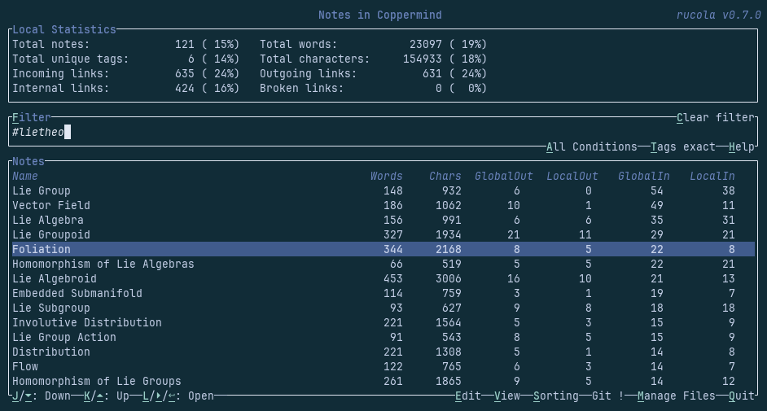
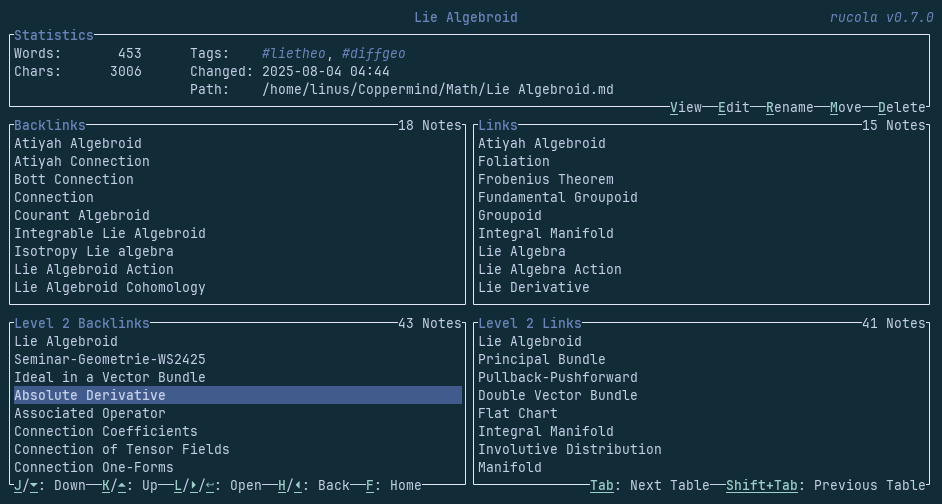

# 🌱 Rucola

[](https://github.com/Linus-Mussmaecher/rucola)
[](https://www.gnu.org/licenses/gpl-3.0)
[](https://github.com/Linus-Mussmaecher/rucola/actions?query=branch%3Amain)
[](https://github.com/Linus-Mussmaecher/rucola/commits/main)
[](https://www.rust-lang.org/)
[](https://www.ratatui.rs/)

Terminal-based note manager and information aggregator for markdown note taking.

> [!CAUTION]
> This is a work-in-progress hobby project.
> All features described on this page are functional, but many are still lacking and bugs may appear frequently.

## Contents
 - [Features](#features)
 - [Target Audience & Comparisons to Similar Programs](#target-audience-comparisons-to-similar-programs)
 - [Future Features](#future-features)
 - [Installation](#installation)
 - [Usage & Configuration](#usage-configuration)
 - [Technology](#technology)
 - [License](#license)

## Features
 - Present users of a zettelkasten-like note system of interlinked markdown files with high-level information & statistics about their notes.
 - Show the same information about filtered subsets of notes, as well as their relation with the entire note set.
 - Allow the user to view and follow links and backlinks of a single note to see connections within their note graph.
 - Allow the user to make small edits such as renaming or moving notes from within the application.
 - Provide easy access to a powerful, external text editor for editing notes.
 - Optionally compile notes to HTML-documents, including LaTeX compilation and code highlighting, on the fly and show them in an external viewer.
 - Provide all of this functionality from within a terminal user interface.

### Images

In the select & overview screen:



Viewing a single note:



## Target Audience & Comparisons to Similar Programs
Rucolas is made for users of a [zettelkasten-style](https://en.wikipedia.org/wiki/Zettelkasten) note system of interlinked markdown notes that want to do most of their note taking directly from within the terminal.

Compared to UI-note taking tools such as **Obsidian**, **Evernote** or **Notion** ...
 - rucola is much more light-weight, using no GUI, no web interface, no Electron, making it faster to open and more responsive to use, particularly on older hardware. Note that viewing your notes as HTML still requires a browser or other HTML viewer.
 - rucola provides easy access to edit notes in your favorite terminal text editor such as vim, emacs or helix, thus allowing a far more powerful editing interface. Although Obsidian provides vim keybindings via plugins, rucola allows you to edit in exactly the plain text environment you are used to with all your vim plugins and other comfort settings ready to go.
 - rucola currently offers less extensibility and thus probably also less powerful statistics, in particular no graph view.
 - rucola relies on an external program to view HTML versions of your markdown notes, allowing once again more customizability (for example with the rich plugin system of browsers like firefox or chrome) as well as more conformity to your usual workflow.
 - rucola is not a single all-in-one application but works as a note browser that also glues an HTML viewer to an editor.

Compared to using only a terminal text editor (such as **vim**, **emacs** or **helix**) to manage markdown notes ...
 - rucola allows more note-specific interaction with your file system, such as following wiki links.
 - rucola provides note-specific statistics about your files, such as tags and links statistics.
 - rucola facilitates more note-specific filtering and searching options based on links, tags, full text or titles.
 - rucola automatically renames wiki links on file rename, which the marksman language server currently does not support, making such a feature unavailable in helix and any other editor relying on LSP for markdown editing.
 - rucola allows you to view nicer-to-read HTML versions of your documents, complete with automatic background conversion (when enabled), which is especially useful for code that is difficult to read in the raw format. In particular, rucola compiles LaTeX and highlights code blocks.
 - rucola requires the usage of multiple programs in parallel instead of just your editor.

## Future Features
The current version is 1.0, as it supports all features I envisioned before embarking on this project and integrates seamlessly into my current workflow.
This does not mean that development is finished.
Future plans include:
 - Frequent & quick bugfixes and similar non-breaking changes.
 - Incorporate user feedback into new features without losing sight of the original scope to also make rucola integrate into _your_ workflow.
 - As development on the underlying markdown parser [comrak](https://github.com/kivikakk/comrak) continues, especially support for wikilinks, certain internal algorithms can be made more safe & efficient (especially link updating on name changes).
   This is dependent on the progress on comrak.
 - As development on the [ratatui markdown reader](https://github.com/joshka/tui-markdown) continues, a possible future option would be to allow viewing of markdown files right within rucola.
   This is dependent on the progress on ratatui-markdown.

## Installation
Currently, the only way to use this program is to clone this repository with
```
 git clone https://github.com/Linus-Mussmaecher/rucola
```
and install it via
```
 cargo install --path .
```

### Usage & Configuration

Rucola can be launched from your command line with the `rucola` command.
By default, the current folder will be considered your 'vault' folder and the root of your note structure, but a different vault can be set in the configuration file or passed as a positional argument such as `rucola ~/Documents/notes`.

For more information on possible configuration options, see the [wiki entry](todo).
Note that HTML conversions needs to be manually disabled in the configuration file.

## Technology
Rucola is implemented using the [ratatui](https://ratatui.rs) framework in [Rust](https://www.rust-lang.org/). Markdown parsing is done via [comrak](https://github.com/kivikakk/comrak).

## License
Rucola is released under the [GNU General Public License v3](https://www.gnu.org/licenses/gpl-3.0).

Copyright (C) 2024 Linus Mußmächer <linus.mussmaecher@gmail.com>

This program is free software: you can redistribute it and/or modify it under the terms of the GNU General Public License as published by the Free Software Foundation, either version 3 of the License, or (at your option) any later version.

This program is distributed in the hope that it will be useful, but WITHOUT ANY WARRANTY; without even the implied warranty of MERCHANTABILITY or FITNESS FOR A PARTICULAR PURPOSE. See the GNU General Public License for more details.

You should have received a copy of the GNU General Public License along with this program.  If not, see <https://www.gnu.org/licenses/>.
